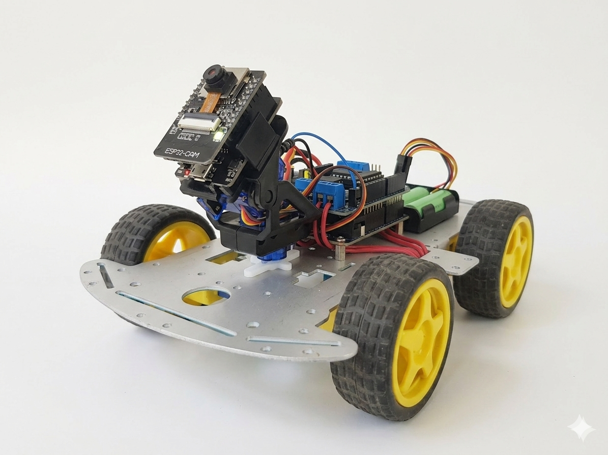
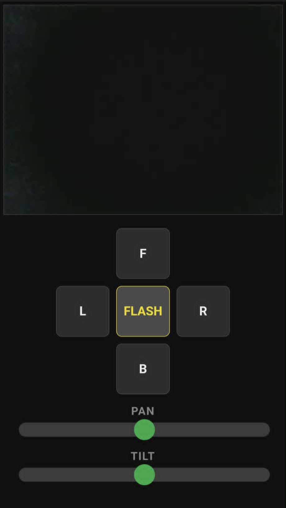
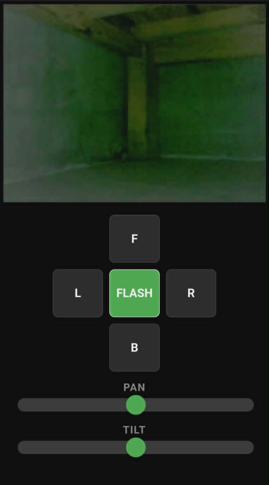

# GDx (Ground Drone Experimental)

**GDx** is a dual-MCU robotics platform designed for localized surveillance and remote exploration. It features a high-bandwidth MJPEG video stream using the **OV3660** sensor and a custom 2-DOF Pan-Tilt camera system[cite: 3, 4].

---

## 📸 Project Gallery

### Hardware Overview
The drone utilizes a 4WD aluminum chassis powered by dual 18650 Li-ion batteries. The "Brain" consists of an **Arduino Uno** for locomotion and an **ESP32-CAM** for high-level networking and vision[cite: 3, 4].

---

### Control Interface
The GDx is operated via a custom mobile-responsive web application. The interface provides real-time movement controls, granular camera gimbal adjustment, and a dedicated toggle for the onboard flash LED[cite: 3, 4].

| **Normal View** | **Flash Active** |
| :---: | :---: |
|  |  |
| *Standard MJPEG stream in low-light.* | *Integrated LED Flash enabled for high-visibility.* |

---

## ⚙️ Hardware Specifications
*   **Camera Module**: **OmniVision OV3660** (3MP).
    *   *Firmware is specifically optimized for OV3660 registers to ensure stable MJPEG streaming.*
*   **Microcontrollers**: ESP32-S (AI-Thinker) & Arduino Uno Rev3[cite: 3, 4].
*   **Antenna System**: Default PCB antenna (bridgeable for external 2.4GHz pigtail support).
*   **Actuators**: 4x DC Motors (L298N Driver) + 2x SG90 Micro Servos.

---

## 🚀 Quick Start & Usage

### 1. Networking
*   **SSID**: `SSID` | **Password**: `password`[cite: 4].
*   **Access Point**: Connect your device to the drone's WiFi and navigate to `192.168.4.1` in your browser[cite: 4].
*   **Credentials**: These can be modified within the `ESP32-CAM_Final.ino` source code[cite: 4].

### 2. Controls
*   **Movement**: Use **F** (Forward), **B** (Backward), **L** (Left), and **R** (Right) buttons[cite: 3, 4].
*   **Gimbal**: Use **PAN** and **TILT** sliders for horizontal and vertical rotation[cite: 3, 4].
*   **Flash**: Toggle the **FLASH** button to enable the onboard high-brightness LED[cite: 4].

### 3. Startup Behavior
*   **Auto-Leveling**: Upon startup, the camera gimbal is programmed to face forward and center itself ($P: 75, T: 135$).
*   **Idle State**: If the signal is lost for 10 seconds, the fail-safe routine triggers, returning the camera to the front-facing position and stopping all motor activity[cite: 3].

---

## 🛠 Deployment Notes

*   **Programming Protocol**: When uploading code to the Arduino, disconnect the ESP32-CAM to avoid Serial bus conflicts. If the connection is permanent (soldered), hold the **Reset** button on the ESP32-CAM during the Arduino upload to put it in a cutoff state[cite: 3].
*   **RF Environment**: Outdoor operation is recommended to maximize range. Nearby metals and 2.4GHz devices (like routers) can cause Electromagnetic Interference (EMI) that degrades the video feed[cite: 4].
*   **Range Extension**: The ESP32-CAM range can be extended by attaching an external antenna. This requires a hardware modification: moving the 0-ohm resistor (acting as a switch) to the external antenna pads.

---

## 🔍 Troubleshooting

| Issue | Solution |
| :--- | :--- |
| **Cannot connect to AP** | Press the **Reset** button on the ESP32-CAM[cite: 4]. |
| **No SSID visible** | Battery is likely low. The ESP32-CAM is power-hungry due to constant WiFi, live video, and flash usage[cite: 4]. |
| **Video feed lost** | Refresh the web page. If the issue persists, reset the ESP32-CAM. Ensure no physical obstructions are blocking the link[cite: 4]. |
| **Continuous Spinning** | If GDx spins after an ESP32-CAM reset, press the **Arduino Reset** button to clear the motor buffer[cite: 3]. |

---

## ⚖ License
Distributed under the **MIT License**. See `LICENSE` for more information.
